# 【硬核盘点】从“裸奔”到“幻形”：2025年科学上网协议战力排行榜 🛡️

**作者：** GLM4.6+TRAECN
**时间：** 2025年  

在这个万物皆可AI检测的时代，选对协议比选对服务器更重要。很多小白看着 V2Ray 里那一堆 VMess、VLESS、Trojan、Shadowsocks 就像看天书。

今天咱们不整虚的，直接搞个**战力排行榜**。但在深入排行榜之前，让我们先了解这些传输协议的核心特征和工作原理。

## 🔍 传输协议基础解析

### 什么是网络传输协议？

网络传输协议是规定了数据如何在网络中传输的规则集合。在科学上网场景中，这些协议主要解决两个核心问题：
1. **数据加密**：确保传输内容不被第三方窃取或篡改
2. **流量伪装**：使加密流量看起来像正常的网络通信，避免被识别和阻断

### 传输协议的核心特征

#### 1. 加密机制
- **对称加密**：如AES，用于加密实际传输数据
- **非对称加密**：如RSA，用于安全交换密钥
- **哈希函数**：如SHA-256，用于验证数据完整性

#### 2. 传输层基础
- **TCP协议**：可靠传输，但特征明显，易被识别
- **UDP协议**：速度快，但可靠性较低，适合特定场景
- **WebSocket**：基于TCP，伪装成HTTP长连接

#### 3. 流量伪装技术
- **协议伪装**：将流量伪装成HTTPS、HTTP/3等常见协议
- **证书伪造**：使用合法域名证书增强可信度
- **行为模拟**：模拟正常浏览行为模式

### 工作原理详解

科学上网协议通常采用**客户端-服务器**架构，工作流程如下：

```
用户请求 → 客户端加密 → 伪装流量 → 网络传输 → 服务器解密 → 目标网站
```

#### 数据传输流程

1. **请求封装**：
   - 用户发起请求（如访问google.com）
   - 客户端将请求数据打包
   - 使用协议特定格式封装

2. **加密处理**：
   - 应用层加密数据内容
   - 传输层可能添加额外加密层
   - 生成校验和确保数据完整性

3. **流量伪装**：
   - 添加伪装头部信息
   - 模拟正常协议行为特征
   - 可能通过中转服务器进一步混淆

4. **数据传输**：
   - 通过互联网传输数据包
   - 可能经过多个中转节点
   - 应对网络干扰和封锁

5. **解密与转发**：
   - 服务器接收并验证数据
   - 解密获取原始请求
   - 转发到目标网站
   - 将响应数据按相同流程返回

今天咱们不整虚的，直接搞个**战力排行榜**。

## 📊 评分标准（满分100）

为了公平起见，我们把分数拆成两半：

1.  **🛡️ 数据安全分（50分）：** 你的账号密码、浏览的小说、视频会不会被中间人（黑客、运营商）看光？
2.  **🥷 隐蔽抗封分（50分）：** 你的流量在防火墙（GFW）眼里像不像"良民"？会不会导致你的IP秒被封？

### 🏆 段位划分
*   **100-90分：** 🧱 **夯 (Hāng)** —— 叹息之墙，稳如老狗。
*   **90-80分：** 💎 **顶级** —— 极其好用，虽然有微小瑕疵。
*   **80-60分：** 🎩 **人上人** —— 曾经的王者，现在的中产，能用但要看脸。
*   **60-40分：** 😐 **NPC** —— 特征太明显，基本上是送人头。
*   **40-0分：** 💩 **拉** —— 纯纯的垃圾，狗都不用。

---

## 第五梯队：💩 拉 (The Trash)
**得分范围：0 - 10分**

### 代表选手：HTTP 代理、SOCKS5 (无账号/强加密版)、Telnet
*   **数据安全：0分**
*   **隐蔽抗封：0分**

#### 技术原理详解

##### HTTP代理
HTTP代理是最早的代理技术，工作在应用层，主要处理HTTP/HTTPS请求。

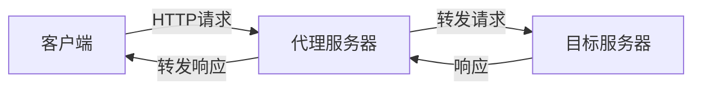

**工作流程**：
1. 客户端向代理服务器发送HTTP请求
2. 代理服务器解析请求并转发给目标服务器
3. 目标服务器响应代理服务器
4. 代理服务器将响应转发给客户端

**技术特点**：
- 无加密：所有数据以明文形式传输
- 无身份验证：通常不验证用户身份
- 无混淆：流量特征明显，易于识别

##### SOCKS5代理
SOCKS5工作在会话层，比HTTP代理更底层，支持多种协议。

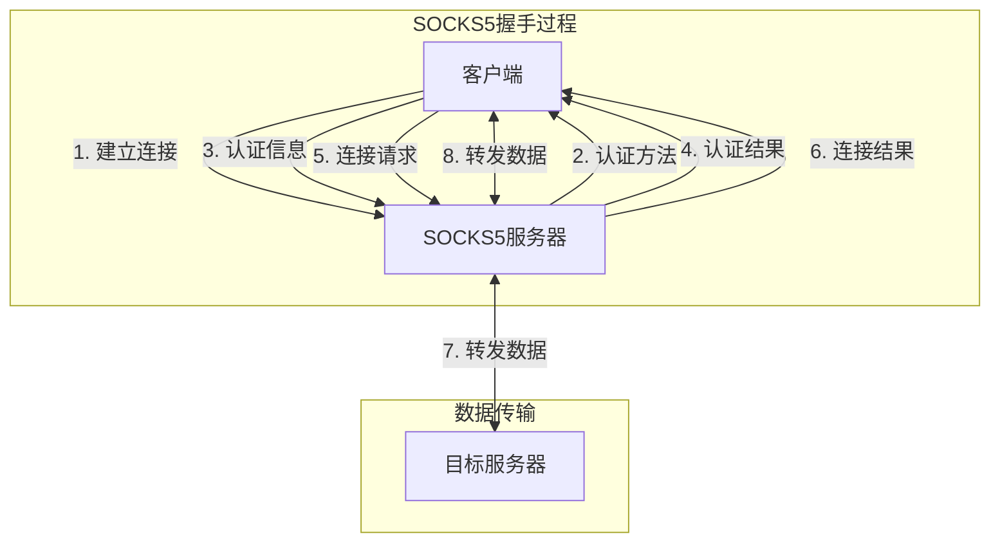

**技术特点**：
- 支持TCP/UDP：比HTTP代理更灵活
- 可选认证：支持多种认证方式，但多数不启用
- 无加密：数据传输仍然是明文

#### 【点评】
这就叫**裸奔**。
你在上面发个"123"，运营商那里显示的就是"123"。你上什么网站，甚至你输入的密码，中间人看得一清二楚。
这不仅是封IP的问题，这是请喝茶的直通车。甚至都不需要GFW动手，普通的网管都能把你掐了。
**结论：** 谁用谁是大聪明。

---

## 第四梯队：😐 NPC (Mediocre)
**得分范围：40 - 55分**

### 代表选手：OpenVPN、PPTP、L2TP、以及 **VMess (不带TLS)**
*   **数据安全：50分**（满分，AES-256加持，没人能破解你的内容）
*   **隐蔽抗封：5分**（特征极其明显）

#### 技术原理详解

##### OpenVPN
OpenVPN是一个开源VPN解决方案，使用SSL/TLS进行安全通信。

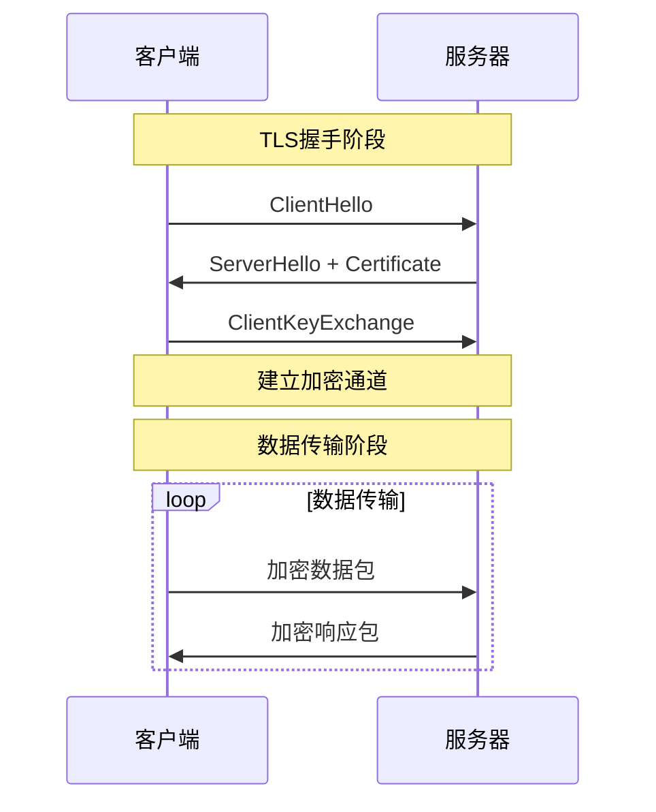

**技术架构**：
- **加密层**：使用OpenSSL库，支持AES-256-CBC等强加密算法
- **认证层**：支持证书认证、预共享密钥、用户名密码等多种认证方式
- **传输层**：基于TCP或UDP，默认使用1194端口

**数据包结构**：
```
+------------------+
|    IP头部        |
+------------------+
|   UDP/TCP头部    |
+------------------+
|   OpenVPN头部    |
|  (包含 opcode)   |
+------------------+
|   加密载荷       |
+------------------+
|   HMAC签名       |
+------------------+
```

**安全特性**：
- 完美前向保密（PFS）：使用Diffie-Hellman密钥交换
- 数据完整性验证：HMAC-SHA256
- 重放攻击防护：时间戳和序列号

##### VMess (无TLS版本)
VMess是V2Ray的核心协议，无TLS版本直接暴露协议特征。

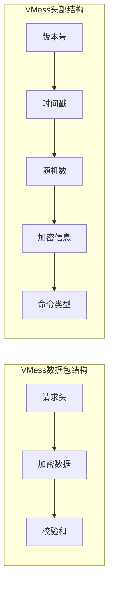

**技术特点**：
- **加密算法**：AES-128-GCM或ChaCha20-Poly1305
- **时间戳验证**：防止重放攻击，但也暴露了协议特征
- **固定头部格式**：易于被深度包检测(DPI)识别

**流量特征分析**：
- 固定的数据包大小模式
- 特定的握手序列
- 明显的时间戳格式

##### PPTP/L2TP
这些是早期的VPN协议，主要为企业远程访问设计。

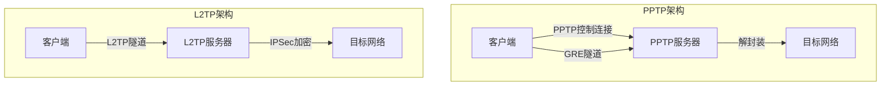

**安全弱点**：
- **PPTP**：使用MS-CHAPv2认证，已被证明存在严重漏洞
- **L2TP/IPSec**：实现复杂，配置错误常见
- **固定端口**：PPTP使用1723端口，L2TP使用1701端口，易于识别

#### 【点评】
这里是重灾区，也是你那个截图里 **VMess 节点（传输层安全为空）** 所在的位置。
这类协议就像是运钞车。虽然车是防弹的（数据加密，绝对安全），但是车身上写着巨大的几个字："**我是运送秘密数据的**"。
GFW 不需要知道你运的是什么，它只要看到这辆特征明显的车，直接拦截。
*   **VMess (无TLS)：** 虽然内容加密了，但数据包长得太像翻墙流量了，现在基本是秒封。
*   **OpenVPN：** 企业级安全，但在墙面前脆得像张纸，握手阶段直接被识别。

---

## 第三梯队：🎩 人上人 (Privileged)
**得分范围：60 - 75分**

### 代表选手：Shadowsocks (SS)、SSR、VMess+TLS
*   **数据安全：50分**
*   **隐蔽抗封：20分 - 40分**

#### 技术原理详解

##### Shadowsocks (SS)
Shadowsocks是一个轻量级的代理协议，最初设计为 circumvention tool。

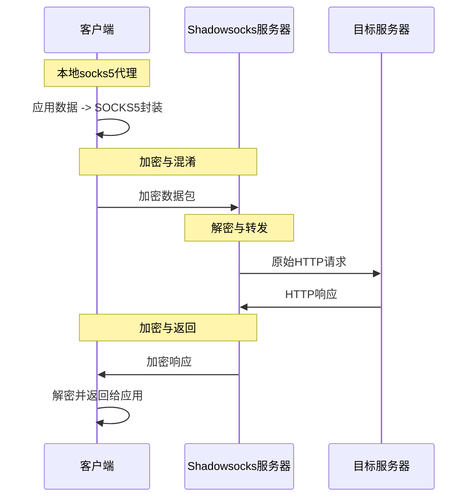

**技术架构**：
- **加密层**：支持多种加密算法（AES-256-CFB, AES-256-GCM, ChaCha20-IETF-Poly1305等）
- **混淆层**：通过加密实现流量混淆，无额外混淆
- **传输层**：基于TCP，可配置端口

**数据包结构**：
```
+------------------+
|    IV (随机向量) |
|    (取决于算法)  |
+------------------+
|   加密载荷       |
|  (TCP流或UDP包)  |
+------------------+
|   HMAC签名       |
|   (部分算法)     |
+------------------+
```

**工作流程**：
1. 客户端在本地启动SOCKS5代理
2. 应用连接到本地SOCKS5代理
3. 客户端加密数据并发送到远程服务器
4. 服务器解密并转发到目标服务器
5. 响应数据按相同流程返回

**流量特征分析**：
- 加密流量特征明显，缺乏伪装
- 固定的连接模式（连接-传输-关闭）
- 无正常协议握手过程

##### ShadowsocksR (SSR)
ShadowsocksR是Shadowsocks的一个增强版，增加了额外的混淆和协议插件。

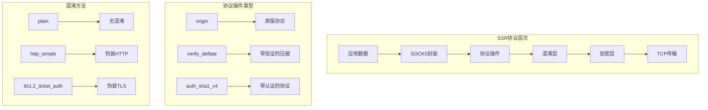

**技术特点**：
- **协议插件**：增加额外的协议层，增强隐蔽性
- **混淆层**：支持多种混淆方法，模拟正常流量
- **多参数组合**：协议、混淆、加密可自由组合

**安全弱点**：
- 固定混淆模式：长期使用易被识别
- 主动探测脆弱性：GFW可通过主动探测识别协议
- 协议特征：虽然经过混淆，但仍存在可识别模式

##### VMess+TLS
VMess协议结合TLS传输层，增强隐蔽性。

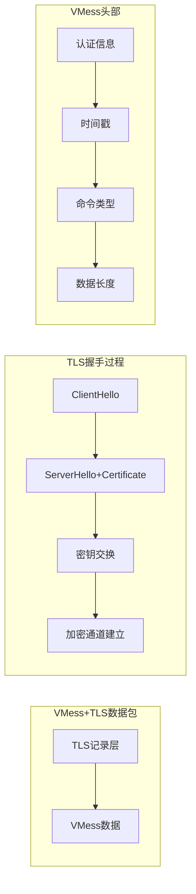

**技术特点**：
- **TLS伪装**：使用标准TLS握手，模拟HTTPS流量
- **VMess协议**：保持原有的认证和加密机制
- **灵活性**：支持多种传输方式（TCP, WebSocket, HTTP/2）

**流量特征分析**：
- TLS指纹问题：与标准浏览器TLS指纹存在差异
- 握手模式：虽然使用TLS，但握手过程可能存在特征
- 证书验证：自签名证书或非标准证书配置易被识别

#### 【点评】
时代的眼泪，曾经的屠龙少年。
*   **Shadowsocks/SSR：** 它们把数据弄成了一团乱麻（随机数流）。在以前，墙看不懂就放行了。但现在墙学会了"熵值分析"和"主动探测"，一旦发现这团乱麻很可疑，直接封杀。
*   **VMess+TLS：** 给运钞车外面套了个集装箱（TLS）。看起来像正常的HTTPS流量了。但是！因为握手特征不够完美（指纹问题），在敏感时期（开会期间）依然容易被精准识别。

---

## 第二梯队：💎 顶级 (Top Class)
**得分范围：80 - 89分**

### 选手A：VLESS + WS + TLS + CDN
### 选手B：Hysteria 2 (Hy2)、TUIC v5
*   **数据安全：50分**
*   **隐蔽抗封：35分 - 45分**

#### 技术原理详解

##### VLESS + WS + TLS + CDN
这是VLESS协议与WebSocket、TLS和CDN的结合，提供高度隐蔽的传输方式。

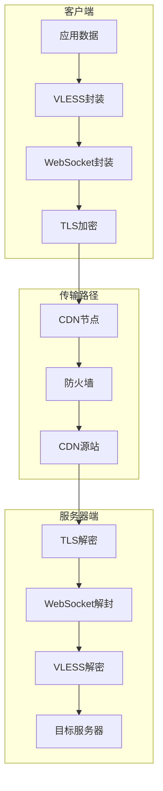

**技术架构**：
- **VLESS协议**：无状态的轻量级协议，减少特征
- **WebSocket传输**：伪装成WebSocket长连接
- **TLS加密**：标准TLS 1.3，模拟HTTPS流量
- **CDN中转**：通过Cloudflare等CDN服务隐藏真实服务器IP

**数据包结构**：
```
+------------------+
|    IP头部        |
+------------------+
|   TCP头部        |
+------------------+
|   TLS记录层      |
+------------------+
|   WebSocket帧    |
|   (掩码/载荷长度)|
+------------------+
|   VLESS协议头    |
+------------------+
|   加密载荷       |
+------------------+
```

**工作流程**：
1. 客户端使用VLESS协议封装数据
2. 添加WebSocket帧头，模拟WebSocket连接
3. 使用TLS加密整个连接
4. 连接到CDN节点，而非直接连接服务器
5. CDN将流量转发到真实服务器
6. 服务器逆向处理各层封装

**隐蔽性分析**：
- 流量特征：与正常HTTPS/WebSocket流量几乎一致
- IP隐藏：真实服务器IP被CDN隐藏
- 证书可信：使用CDN提供的可信证书
- 行为模式：符合正常Web应用访问模式

##### Hysteria 2 (Hy2)
Hysteria 2是一个基于QUIC协议的高性能代理协议。

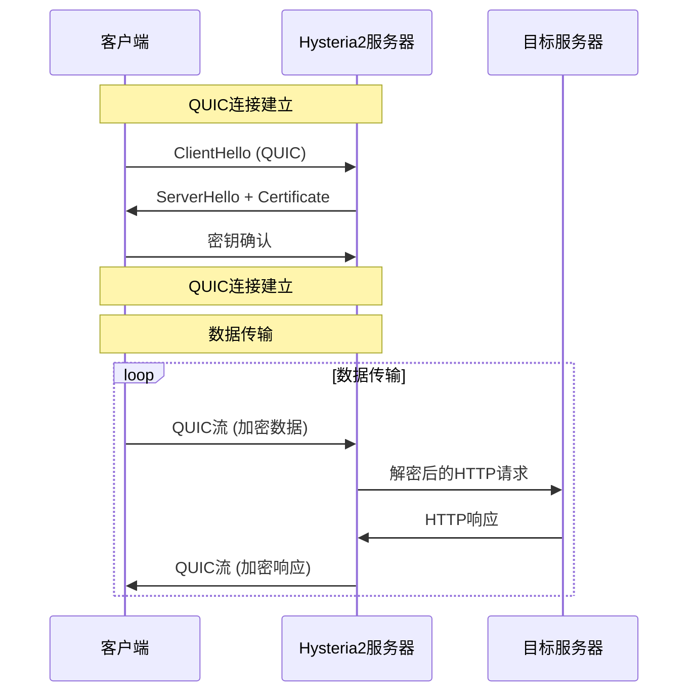

**技术架构**：
- **传输层**：基于QUIC协议（UDP）
- **加密层**：TLS 1.3集成在QUIC中
- **拥塞控制**：自定义拥塞控制算法，优化性能
- **伪装层**：伪装成HTTP/3流量

**数据包结构**：
```
+------------------+
|    IP头部        |
+------------------+
|   UDP头部        |
+------------------+
|   QUIC包头       |
|  (连接ID/包号)   |
+------------------+
|   TLS记录层      |
+------------------+
|   Hysteria2帧    |
+------------------+
|   加密载荷       |
+------------------+
```

**技术特点**：
- **多路复用**：QUIC原生支持多路复用，减少连接开销
- **连接迁移**：支持IP地址变更时保持连接
- **前向纠错**：可选的FEC机制，提高丢包环境下的性能
- **性能优化**：针对高延迟、高丢包网络环境优化

**流量特征分析**：
- 协议伪装：模拟HTTP/3流量特征
- 行为模式：QUIC特有的连接模式和传输特征
- 端口特征：通常使用443端口，模拟HTTPS
- 数据模式：QUIC特有的包大小和发送模式

##### TUIC v5
TUIC是另一个基于QUIC的代理协议实现，与Hysteria 2类似但有不同设计。

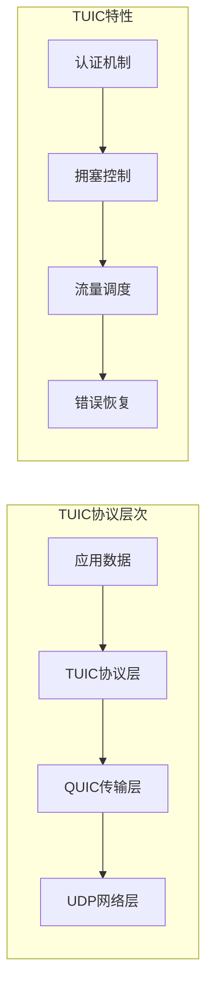

**技术特点**：
- **轻量设计**：比Hysteria 2更轻量，资源占用更少
- **认证机制**：使用UUID和密码进行认证
- **多路复用**：支持在单个QUIC连接上传输多个流
- **可靠性**：QUIC提供的可靠传输保证

#### 【点评】
这里分两派：
1.  **不死流 (CDN)：**
    **VLESS+WS+TLS+CDN** 就像是"秽土转生"。你的IP被封了？没事，套上 Cloudflare 的 CDN，墙不敢封 Cloudflare 的所有IP。
    *   **缺点：** 速度慢，延迟高，可以说是"网络减速器"。
2.  **暴力流 (UDP)：**
    **Hysteria 2 / TUIC** 使用 UDP 协议（QUIC）。它们把翻墙流量伪装成 HTTP/3。速度极其快，甚至能把垃圾线路跑满宽带。
    *   **缺点：** 很多运营商（尤其是公司内网、学校）会歧视 UDP 流量，导致经常断流。

---

## 第一梯队：🧱 夯 (The Solid / God Tier)
**得分范围：90 - 100分**

### 代表选手：VLESS + Vision + Reality、NaiveProxy
*   **数据安全：50分**
*   **隐蔽抗封：48分**

#### 技术原理详解

##### VLESS + Vision + Reality
这是目前最先进的代理协议组合，实现了极致的流量伪装。

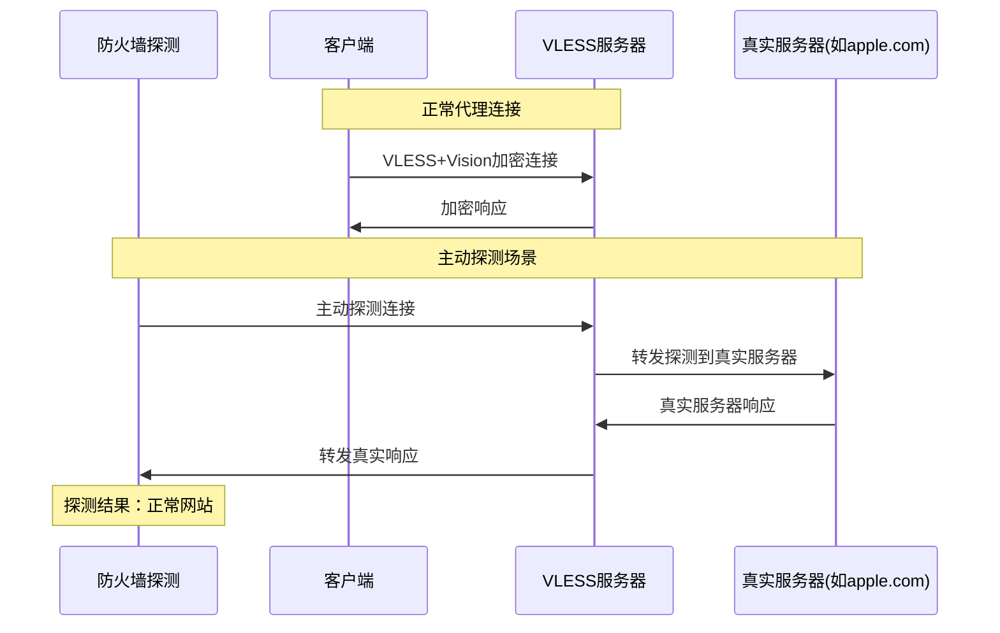

**技术架构**：
- **VLESS协议**：无状态轻量级协议，减少连接特征
- **Vision流控**：增强的流量控制机制，优化传输性能
- **Reality伪装**：使用真实网站证书和流量特征进行伪装

**Reality工作原理**：
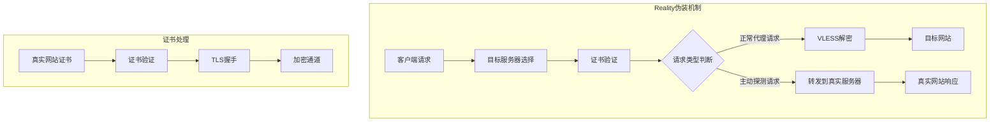

**数据包结构**：
```
+------------------+
|    IP头部        |
+------------------+
|   TCP头部        |
+------------------+
|   TLS记录层      |
|  (使用真实证书)  |
+------------------+
|   VLESS协议头    |
+------------------+
|   Vision流控     |
+------------------+
|   加密载荷       |
+------------------+
```

**技术特点**：
- **真实证书**：使用目标网站（如apple.com）的真实证书
- **请求转发**：将主动探测请求转发到真实服务器
- **无特征协议**：VLESS协议本身特征极少
- **智能识别**：能区分正常代理请求和主动探测

**隐蔽性分析**：
- 证书可信：使用真实网站证书，无法通过证书验证识别
- 流量特征：与真实网站流量完全一致
- 行为模式：对主动探测响应与真实网站一致
- 指纹特征：TLS指纹与真实浏览器一致

##### NaiveProxy
NaiveProxy使用Chrome网络栈实现高度伪装的代理。

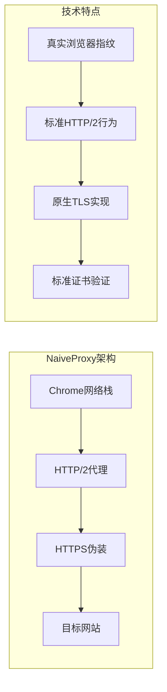

**技术架构**：
- **Chrome网络栈**：直接使用Chrome浏览器的网络组件
- **HTTP/2代理**：基于HTTP/2的代理机制
- **原生TLS**：使用Chrome的原生TLS实现

**工作流程**：
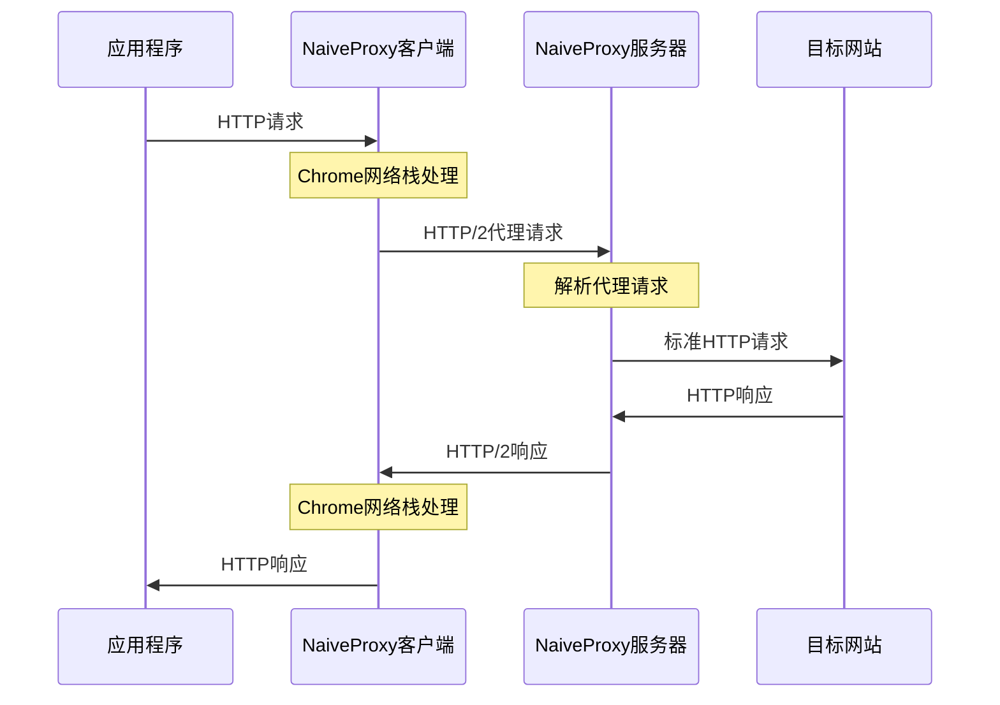

**技术特点**：
- **真实浏览器行为**：完全模拟Chrome浏览器的网络行为
- **HTTP/2优化**：利用HTTP/2的多路复用和流控制
- **标准TLS**：使用Chrome的标准TLS实现和指纹
- **证书处理**：完整的证书验证链

**流量特征分析**：
- TLS指纹：与Chrome浏览器完全一致
- HTTP/2行为：标准HTTP/2连接模式和流管理
- 证书验证：完整的证书验证过程
- 连接模式：与正常浏览行为一致

#### 【点评】
这是目前的**版本之子**，也是你那张图里的大佬们极力推荐的。

*   **VLESS + Vision + Reality (Xray内核)：**
    这叫**极致的伪装（偷梁换柱）**。
    以前的协议还需要你自己买域名、搞证书。Reality 不需要！它可以直接"偷"别人的证书（比如它伪装自己是 apple.com 或者 microsoft.com）。
    GFW 发起主动探测时，你的服务器会把请求转发给真实的苹果/微软服务器，墙看到的是真证书、真网站。
    **它不只是伪装，它是成为了真的（在墙看来）。**
    *   **优点：** 极难被检测，配置简单（不用买域名），速度快。

*   **NaiveProxy：**
    这个更变态。它直接把 Chrome 浏览器的网络栈扒下来用了。在墙看来，你的流量特征和全世界几亿人用 Chrome 浏览网页**一模一样**。
    *   **优点：** 稳如老狗。
    *   **缺点：** 客户端生态不如 V2Ray/Xray 丰富。

---

## 📝 总结：该怎么选？

1.  **想当"夯"货（最推荐）：** 直接上 **VLESS + Vision + Reality**。不用买域名，速度快，稳得一批。
2.  **网络环境差，想看4K视频：** 试试 **Hysteria 2**，大力出奇迹。
3.  **IP总被封，想要复活甲：** 准备一个 **VLESS + WS + TLS + CDN** 备用，慢是慢了点，但能救命。
4.  **想低调一点：** **NaiveProxy**，浏览器内核，伪装得跟真的一样。

---

**【免责声明】**
本文仅用于技术交流和学习目的，不鼓励任何形式的非法活动。科学上网应遵循当地法律法规，尊重网络环境和服务提供商。