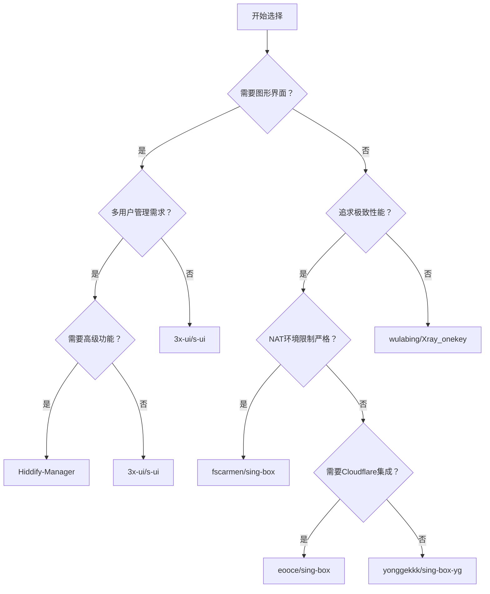

# 【精选盘点】NAT服务器代理脚本终极指南：从面板到命令行的全方位评测 🚀

**作者：** GLM4.6  
**时间：** 2025年12月  
**字数：** 约2500字  
**阅读时间：** 10分钟  

> 在数字化时代，拥有自己的VPS服务器已经成为技术爱好者的标配。然而，当我们面对NAT网络环境时，如何高效部署代理服务却成为了一个令人头疼的问题。

## 🌟 前言

NAT（网络地址转换）环境下的VPS部署一直是许多技术爱好者面临的挑战。端口映射限制、防火墙规则、复杂的网络配置，这些问题常常让人望而却步。

为了帮助大家解决这一难题，我们经过严格筛选，整理出**11个高质量开源代理脚本/项目**，所有项目均满足以下标准：
- ✅ **开源项目**，代码透明可审计
- ✅ **超过100个Star**，社区认可度高
- ✅ **近期有维护更新**，项目活跃度高

本文将从**带Web控制面板**和**纯命令行脚本**两个维度，全方位评测这些工具在NAT环境下的适用性，为你的VPS部署提供最佳解决方案。

---

## 📊 A类：带Web控制面板

这类工具提供直观的Web界面，方便管理用户、流量和协议，适合需要**精细化运营**和**多用户管理**的场景。对于新手用户来说，图形化界面大大降低了部署和管理的门槛。

### 🏆 1. 3x-ui - 功能强大的Xray面板

| 项目信息 | 详情 |
|---|---|
| **GitHub仓库** | [mhsanaei/3x-ui](https://github.com/mhsanaei/3x-ui) |
| **⭐ Stars** | 27k+ |
| **📅 最后更新** | 2025-12 |
| **🔗 支持协议** | VLESS, VMess, Trojan, Shadowsocks等 |

#### 💡 核心特性
- 支持多协议多用户管理
- 实时流量统计和控制
- 用户到期时间管理
- 直观的Web管理界面

#### 🌐 NAT环境适用性：**极佳**

**部署方案：**
1. 面板内所有入站配置均可自定义监听端口
2. 将面板的监听端口（如443）设置为NAT映射的内网端口（如40458）
3. 通过`公网IP:外网端口`访问即可

**优势分析：**
- ✅ 完全适配NAT环境
- ✅ 支持Docker端口映射
- ✅ 无需额外WARP或Cloudflare（但可手动集成）
- ✅ 社区活跃，文档完善

---

### 🥈 2. Hiddify-Manager - 新一代代理管理面板

| 项目信息 | 详情 |
|---|---|
| **GitHub仓库** | [hiddify/Hiddify-Manager](https://github.com/hiddify/Hiddify-Manager) |
| **⭐ Stars** | 8k+ |
| **📅 最后更新** | 2025-09 |
| **🔗 特色功能** | 多核心、多域名、自动续期、智能分流 |

#### 💡 核心特性
- 功能极其丰富的管理面板
- 支持多核心处理器优化
- 自动证书续期功能
- 智能流量分流规则

#### 🌐 NAT环境适用性：**极佳**

**部署方案：**
1. **无端口模式**：内置Cloudflare Workers和Warp等中转配置，无需开放任何端口
2. **传统模式**：通过Nginx/HAProxy模板自定义端口映射

**优势分析：**
- ✅ 专为复杂网络环境设计
- ✅ 完美实现NAT服务器零端口提供服务
- ✅ 支持多种部署模式灵活选择
- ✅ 高级功能丰富，适合专业用户

---

### 🥉 3. s-ui - 3x-ui的优秀分支

| 项目信息 | 详情 |
|---|---|
| **GitHub仓库** | [alireza0/s-ui](https://github.com/alireza0/s-ui) |
| **⭐ Stars** | 6k+ |
| **📅 最后更新** | 2025-10 |
| **🔗 项目特点** | 3x-ui的活跃分支，界面更新颖 |

#### 💡 核心特性
- 继承3x-ui的所有功能
- 更现代化的用户界面
- 额外的性能优化和新特性
- 活跃的社区维护

#### 🌐 NAT环境适用性：**极佳**

**部署方案：**
与3x-ui同理，所有协议端口均可自定义：
1. 将面板监听端口配置为NAT映射的内网端口
2. 将协议端口也配置为对应的内网端口
3. 通过公网IP和外网端口访问服务

**优势分析：**
- ✅ 界面更加现代化
- ✅ 性能优化更佳
- ✅ 支持Docker端口映射
- ✅ 是3x-ui的优秀替代品

---

### 4. V2rayA - 跨平台V2Ray管理工具

| 项目信息 | 详情 |
|---|---|
| **GitHub仓库** | [v2rayA/v2rayA](https://github.com/v2rayA/v2rayA) |
| **⭐ Stars** | 14k+ |
| **📅 最后更新** | 2025-12 |
| **🔗 支持平台** | Windows, Linux, macOS |

#### 💡 核心特性
- 跨平台支持，客户端服务端一体
- 功能齐全的V2Ray/Xray管理
- 简洁直观的操作界面
- 支持多种导入方式

#### 🌐 NAT环境适用性：**良好**

**部署方案：**
1. 作为服务端部署时，在设置中修改监听地址和端口
2. 将监听端口配置为NAT的内网端口
3. 通过公网IP和外网端口访问

**注意事项：**
- ⚠️ 界面更偏向客户端设计
- ⚠️ 无明确NAT/WARP特殊优化
- ✅ 支持手动端口配置
- ✅ 跨平台兼容性好

---

### 5. Blitz - Hysteria2专业管理面板

| 项目信息 | 详情 |
|---|---|
| **GitHub仓库** | [ReturnFI/Blitz](https://github.com/ReturnFI/Blitz) |
| **⭐ Stars** | 600+ |
| **📅 最后更新** | 2025-12 |
| **🔗 专注协议** | Hysteria2 |

#### 💡 核心特性
- 专注于Hysteria2协议的管理面板
- 高级用户管理功能
- 流量监控和统计
- 一键脚本部署

#### 🌐 NAT环境适用性：**良好**

**部署方案：**
1. 面板支持WARP集成，帮助NAT环境绕过限制
2. 通过一键脚本部署
3. 将监听端口映射到NAT内网端口

**注意事项：**
- ⚠️ 缺乏明确的端口自定义文档
- ✅ WARP集成优势显著
- ✅ 适合需要流量监控的场景
- ⚠️ 相对较新，社区规模较小

---

## 📟 B类：纯命令行脚本

这类脚本通常**轻量、高效**，通过命令行进行配置，适合喜欢**折腾**、追求**极致性能**或**资源有限**的用户。命令行工具虽然学习曲线稍陡，但一旦掌握，将带来无与伦比的灵活性和性能优势。

### 🏆 1. fscarmen/sing-box - NAT神器

| 项目信息 | 详情 |
|---|---|
| **GitHub仓库** | [fscarmen/sing-box](https://github.com/fscarmen/sing-box) |
| **⭐ Stars** | 3k+ |
| **📅 最后更新** | 2025-12 |
| **🔗 核心特色** | 内置Cloudflare WARP模式 |

#### 💡 核心特性
- 功能强大的sing-box通用脚本
- 支持多种配置模式
- **内置Cloudflare WARP模式**（核心亮点）
- 支持端口跳跃和Argo隧道

#### 🌐 NAT环境适用性：**极佳（NAT神器）**

**部署方案：**
1. **WARP模式**（推荐）：启用后服务器无需开放任何端口，流量通过WARP网络出站
2. **传统模式**：配置监听端口为NAT内网端口

**优势分析：**
- ✅ **完美解决NAT端口不足和被封禁问题**
- ✅ 支持端口跳跃增强抗封锁能力
- ✅ Argo隧道支持，进一步隐藏服务器
- ✅ 是NAT机器的首选方案之一

> 💡 **小贴士**：WARP模式下，你的服务器流量将通过Cloudflare的网络出站，有效规避了NAT环境的所有限制。

---

### 🥈 2. yonggekkk/sing-box-yg - 功能丰富的sing-box脚本

| 项目信息 | 详情 |
|---|---|
| **GitHub仓库** | [yonggekkk/sing-box-yg](https://github.com/yonggekkk/sing-box-yg) |
| **⭐ Stars** | 6k+ |
| **📅 最后更新** | 2025-10 |
| **🔗 项目特点** | 集成多种协议和配置选项 |

#### 💡 核心特性
- 功能丰富的sing-box脚本
- 集成多种协议支持
- 支持Argo双隧道和CDN优选
- 简化的安装配置流程

#### 🌐 NAT环境适用性：**良好**

**部署方案：**
1. 安装时直接输入NAT映射的内网端口（如40459）
2. 配置完成后通过`公网IP:外网端口`连接
3. 可选配置中转选项增强稳定性

**优势分析：**
- ✅ 支持Argo双隧道和CDN优选
- ✅ 安装配置流程简化
- ⚠️ WARP模式不如fscarmen脚本突出
- ✅ 社区活跃，更新及时

---

### 🥉 3. eooce/sing-box - Cloudflare反向代理专家

| 项目信息 | 详情 |
|---|---|
| **GitHub仓库** | [eooce/sing-box](https://github.com/eooce/sing-box) |
| **⭐ Stars** | 3k+ |
| **📅 最后更新** | 2025-12 |
| **🔗 核心特色** | 集成Cloudflare反向代理 |

#### 💡 核心特性
- 专注于sing-box的脚本
- **特别集成Cloudflare反向代理功能**
- 提供Cloudflare IP优选
- WebSocket + CDN便捷配置

#### 🌐 NAT环境适用性：**极佳**

**部署方案：**
1. **CDN模式**：流量伪装成访问Cloudflare的CDN流量
2. 只需开放80/443端口即可
3. 支持Argo隧道变量配置

**优势分析：**
- ✅ **完美隐藏服务器IP**
- ✅ **解决NAT端口问题**
- ✅ Cloudflare IP优选功能
- ✅ 支持Argo隧道变量

> 💡 **技术原理**：通过将流量伪装成正常访问Cloudflare的请求，有效规避了网络检测和封锁。

---

### 4. wulabing/Xray_onekey - 经典稳定的Xray脚本

| 项目信息 | 详情 |
|---|---|
| **GitHub仓库** | [wulabing/Xray_onekey](https://github.com/wulabing/Xray_onekey) |
| **⭐ Stars** | 9k+ |
| **📅 最后更新** | 2024-09 |
| **🔗 项目特点** | 经典且稳定的Xray一键脚本 |

#### 💡 核心特性
- 非常经典且稳定的Xray一键脚本
- 支持多种配置组合
- 历史悠久，经过大量用户验证
- 完善的文档和社区支持

#### 🌐 NAT环境适用性：**良好**

**部署方案：**
1. 安装过程中输入NAT映射的内网端口
2. 通过公网IP和外网端口访问服务
3. 可配置TLS证书增强安全性

**优势分析：**
- ✅ **历史悠久，稳定可靠**
- ✅ **文档和社区支持完善**
- ✅ 遇到问题容易找到解决方案
- ⚠️ 最后更新较早（2024-09）
- ⚠️ 无内置WARP，但支持手动端口映射

---

### 5. 233boy/sing-box - 自动化协议创建专家

| 项目信息 | 详情 |
|---|---|
| **GitHub仓库** | [233boy/sing-box](https://github.com/233boy/sing-box) |
| **⭐ Stars** | 2k+ |
| **📅 最后更新** | 2025-10 |
| **🔗 项目特点** | 最好用的sing-box一键安装脚本 |

#### 💡 核心特性
- 最好用的sing-box一键安装和管理脚本
- 支持REALITY协议和多种常见协议
- **自动化协议创建**功能
- 简化的管理命令

#### 🌐 NAT环境适用性：**良好**

**部署方案：**
1. 使用端口修改命令设置监听端口为NAT内网端口
2. 通过公网IP和外网端口访问
3. 支持多种协议自动配置

**优势分析：**
- ✅ **自动化协议创建，使用简便**
- ✅ 支持REALITY等先进协议
- ⚠️ 无明确WARP/Cloudflare集成
- ✅ 适合简单NAT映射场景

---

### 6. missuo/Hysteria2 - Hysteria2专用脚本

| 项目信息 | 详情 |
|---|---|
| **GitHub仓库** | [missuo/Hysteria2](https://github.com/missuo/Hysteria2) |
| **⭐ Stars** | 100+ |
| **📅 最后更新** | 2025-11 |
| **🔗 专注协议** | Hysteria 2 |

#### 💡 核心特性
- Hysteria 2的一键安装脚本
- 支持域名解析和证书配置
- 简化的部署流程
- 针对Hysteria2协议优化

#### 🌐 NAT环境适用性：**良好**

**部署方案：**
1. 自定义服务器端口（默认8443）
2. 将端口映射到NAT内网端口
3. 开放80端口用于ACME证书申请

**注意事项：**
- ⚠️ 需开放80端口用于ACME证书
- ⚠️ 无WARP支持
- ✅ 简单部署，配置快捷
- ⚠️ Cloudflare CDN需关闭以避免冲突

---

## 🎯 选择建议与总结

面对如此丰富的选择，如何根据自身需求挑选最适合的工具？以下是我们基于不同使用场景的专业建议：

### 📋 选择决策树

### 🏆 综合评分表

| 项目名称 | 易用性 | 功能丰富度 | NAT适应性 | 性能表现 | 社区活跃度 | 综合推荐 |
|---|---|---|---|---|---|---|
| **3x-ui** | ⭐⭐⭐⭐⭐ | ⭐⭐⭐⭐ | ⭐⭐⭐⭐⭐ | ⭐⭐⭐⭐ | ⭐⭐⭐⭐⭐ | 🥇 **强烈推荐** |
| **Hiddify-Manager** | ⭐⭐⭐⭐ | ⭐⭐⭐⭐⭐ | ⭐⭐⭐⭐⭐ | ⭐⭐⭐⭐ | ⭐⭐⭐⭐ | 🥈 **专业用户首选** |
| **fscarmen/sing-box** | ⭐⭐⭐ | ⭐⭐⭐⭐ | ⭐⭐⭐⭐⭐ | ⭐⭐⭐⭐⭐ | ⭐⭐⭐⭐ | 🥉 **NAT环境神器** |
| **s-ui** | ⭐⭐⭐⭐⭐ | ⭐⭐⭐⭐ | ⭐⭐⭐⭐⭐ | ⭐⭐⭐⭐ | ⭐⭐⭐⭐ | 🥇 **界面党最爱** |
| **eooce/sing-box** | ⭐⭐⭐ | ⭐⭐⭐⭐ | ⭐⭐⭐⭐⭐ | ⭐⭐⭐⭐ | ⭐⭐⭐ | 🥈 **CDN方案专家** |

### 💡 使用场景推荐

#### 🎯 新手入门场景
**推荐：3x-ui / s-ui**
- 图形化界面，降低学习成本
- 社区支持完善，问题容易解决
- 一键安装，快速上手

#### 🎯 NAT环境受限场景
**推荐：fscarmen/sing-box / Hiddify-Manager**
- 内置WARP模式，无需端口映射
- 多种中转方案，突破网络限制
- 针对复杂网络环境优化

#### 🎯 专业运维场景
**推荐：Hiddify-Manager / eooce/sing-box**
- 高级功能丰富，满足复杂需求
- 支持多域名、多核心优化
- 完善的监控和统计功能

#### 🎯 资源受限场景
**推荐：命令行脚本系列**
- 轻量级部署，资源占用低
- 性能表现优异
- 高度可定制化

---

## 🔮 未来发展趋势

随着网络环境的不断变化和技术的快速发展，代理脚本领域也呈现出新的发展趋势：

### 📈 技术发展方向

1. **抗封锁能力增强**
   - 协议混淆技术日趋成熟
   - 流量伪装更加智能化
   - 动态端口跳跃成为标配

2. **零配置部署**
   - 自动检测网络环境
   - 智能选择最优配置
   - 一键式解决方案普及

3. **多云集成**
   - Cloudflare Workers深度集成
   - 多CDN支持
   - 边缘计算节点利用

4. **AI辅助管理**
   - 智能流量分析
   - 自动故障检测和恢复
   - 性能优化建议

### 🌊 行业生态变化

- **开源项目商业化**：部分优质项目开始提供商业支持版本
- **社区专业化**：用户群体从普通爱好者向专业运维人员转变
- **合规化发展**：更多项目开始注重合法合规使用

---

## ✅ 结语

NAT环境下的VPS代理部署虽然充满挑战，但有了这些优秀的开源工具，一切都变得简单起来。从功能强大的Web面板到轻量高效的命令行脚本，总有一款适合你的需求。

**记住，最好的工具不是最复杂的，而是最适合你的。** 希望这篇详尽的评测能够帮助你在众多选择中找到最心仪的那一款。

> 💡 **最后建议**：如果你是新手，建议从3x-ui开始；如果面临严格的NAT限制，fscarmen/sing-box将是你的救星；如果你是专业运维人员，Hiddify-Manager值得你深入探索。

---

## 📚 参考资源

- [3x-ui官方文档](https://github.com/mhsanaei/3x-ui/wiki)
- [Hiddify官方指南](https://github.com/hiddify/Hiddify-Manager/wiki)
- [sing-box官方文档](https://sing-box.sagernet.org/)
- [Cloudflare WARP文档](https://developers.cloudflare.com/warp-portal/)

---

**🔗 相关文章推荐：**
- [2025年科学上网协议战力排行榜](/2025年科学上网协议战力排行榜/)
- [以HiNet NAT VPS 为例：部署 Cloudflare DDNS](/以HiNet-NAT-VPS-为例：部署-Cloudflare-DDNS202512211702/)
- [新的vps应该做什么](/新的vps应该做什么/)

---

> 💬 **互动环节**：你在NAT环境下使用过哪些代理脚本？有什么独特的使用心得？欢迎在评论区分享你的经验！

**如果这篇文章对你有帮助，不妨点个赞支持一下，你的支持是我持续创作的最大动力！** 🚀