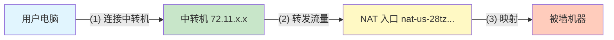
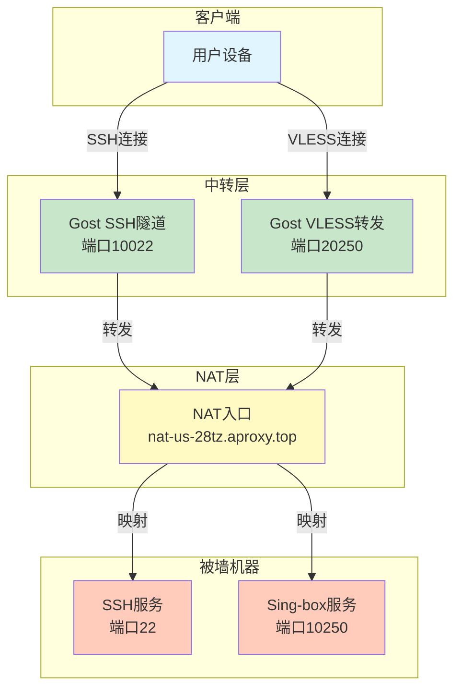

# 【实战笔记】拯救被墙NAT机器：使用Gost中转搭建VLESS-Reality

**作者：** GLM4.7 + TraeCN~~（依旧国内模型和ide）~~  
**时间：** 2025年12月  
**字数：** 约3500字  
**阅读时间：** 15分钟  

> 太棒了！这绝对是一次教科书级别的"救砖"操作。从被墙阻断、到SSH连通、再到JSON配置纠错、DNS修复，最后成功点亮VLESS-Reality-Vision节点，整个过程涵盖了网络工程中最核心的排查逻辑。~~棒在哪?~~

---

## 🌟 前言

手中有一台性能不错的NAT VPS，但因为IP被GFW阻断导致无法连接？这种情况对于技术爱好者来说并不罕见。当你的服务器因为各种原因被"墙"住，无法直接访问时，是不是就意味着这台机器已经变成了一块"废砖"？

答案是否定的。本文将教你利用一台境外"白名单"机器作为跳板，通过流量转发技术"复活"这台机器，实现SSH稳定连接，并最终搭建最先进的VLESS-Reality-Vision节点。

---

## 📊 原理与SSH隧道打通

### 1. 场景与问题分析

我们面临的环境如下：

| 服务器类型 | 配置信息 | 状态 |
|---|---|---|
| **被墙机器 (Target)** | 内网IP：`192.168.105.65`<br>外网映射：`nat-us-28tz.aproxy.top` | ❌ SSH无法连接 |
| **中转机器 (Relay)** | IP：`72.11.154.203` | ✅ 线路正常 |
| **本地电脑** | - | ✅ 需要访问被墙机器 |

**核心痛点**：由于入口IP被墙，直连SSH超时，无法管理被墙机器。

**我们的目标**：通过中转机访问被墙机器，并最终搭建代理服务。

### 2. 核心架构原理

我们要构建一个"流量接力"系统。既然无法直接访问目标，我们就绕道走。



**架构说明**：
1. 用户电脑连接到中转机
2. 中转机将流量转发到NAT入口地址
3. NAT入口通过端口映射将流量转发到被墙机器

### 3. 实施步骤：打通SSH连接

为了管理机器，我们首先需要一个稳定的SSH通道。我们将使用**Gost**这款强大的轻量级隧道工具。

#### 第一步：获取NAT端口信息

登录NAT VPS的管理面板，找到SSH（22端口）对应的公网映射端口。

**假设映射关系**：
```
nat-us-28tz.aproxy.top:36689 -> 192.168.105.65:22
```

> 💡 **小贴士**：不同的NAT服务商端口映射方式可能不同，请根据实际面板操作。

#### 第二步：在中转机上部署Gost

登录中转机（`72.11.154.203`），使用Docker部署Gost进行端口转发。我们将中转机的`10022`端口映射到目标的`36689`。

```bash
# --net=host 模式性能最好，直接使用宿主机网络栈
docker run -d --restart=always --net=host --name gost-ssh \
    ginuerzh/gost \
    -L tcp://:10022/nat-us-28tz.aproxy.top:36689
```

**参数详解**：
- `-L tcp://:10022`：监听本机TCP 10022端口
- `/nat-us-28tz.aproxy.top:36689`：将收到的流量转发给目标的NAT入口地址
- `--net=host`：使用宿主机网络栈，性能最佳
- `--restart=always`：容器自动重启，确保服务稳定

#### 第三步：本地SSH连接测试

现在，我们在本地电脑连接中转机的IP和端口，实际上就连到了被墙机器。

```bash
# 命令格式：ssh root@中转IP -p 中转端口
ssh root@72.11.154.203 -p 10022
```

如果成功输入密码并进入终端，恭喜你！第一阶段完成，你已经夺回了这台机器的控制权。

> 🎉 **里程碑**：通过Gost隧道，我们成功穿透了防火墙，建立了稳定的SSH连接。

---

## 🚀 节点搭建与深度Debug

### 1. 方案选型：为什么是VLESS-Reality-Vision？

在NAT环境且经过中转的情况下，网络环境极其复杂：

| 挑战 | 说明 |
|---|---|
| **没有域名** | NAT机器通常只有共享IP，无法申请SSL证书 |
| **UDP受限** | 许多转发服务或NAT商家对UDP支持不佳（导致Hysteria2等协议无法使用） |
| **阻断风险** | 需要极强的伪装能力 |

**VLESS + Reality + Vision**是完美解：

| 特性 | 优势 |
|---|---|
| **纯TCP** | 稳定，穿透力强 |
| **无需域名/证书** | Reality协议可以"偷"大厂（如微软）的证书进行伪装 |
| **Vision流控** | 极强的抗GFW探测能力 |

### 2. 准备工作（极其重要！）

在安装软件前，必须先做两件事，否则必败无疑。

#### A. 端口映射

在NAT面板再开一个TCP端口用于节点流量。

**映射关系**：
```
nat-us-28tz.aproxy.top:10250 -> 192.168.105.65:10250
```

#### B. 修复DNS和时间（两大隐形杀手）

由于机器长期无法联网，DNS和时间往往是错的。

**校准时间**：
Reality协议要求客户端与服务端时间误差在**90秒以内**。

```bash
apt install ntpdate -y
ntpdate pool.ntp.org
date  # 确认时间是否正确
```

**修复DNS**：
Reality需要解析伪装域名（如microsoft.com）来握手。

```bash
echo "nameserver 8.8.8.8" > /etc/resolv.conf
ping -c 4 www.microsoft.com  # 必须能ping通IP
```

> ⚠️ **警告**：这两步是成功的关键，跳过必败！

### 3. 部署Sing-box服务端

#### 安装

```bash
bash <(curl -fsSL https://sing-box.app/install.sh)
```

#### 生成密钥

```bash
sing-box generate uuid          # 记下UUID
sing-box generate reality-keypair # 记下PrivateKey和PublicKey
```

#### 配置文件（`/etc/sing-box/config.json`）

**注意**：这是经过无数次报错后修正的"黄金配置"。

```json
{
  "log": { 
    "level": "info", 
    "timestamp": true 
  },
  "inbounds": [
    {
      "type": "vless",
      "tag": "vless-in",
      "listen": "::",
      "listen_port": 10250,
      "users": [
        {
          "uuid": "刚刚生成的UUID",
          "flow": "xtls-rprx-vision"
        }
      ],
      "tls": {
        "enabled": true,
        "server_name": "www.microsoft.com",
        "reality": {
          "enabled": true,
          "handshake": {
            "server": "www.microsoft.com",
            "server_port": 443
          },
          "private_key": "刚刚生成的PrivateKey",
          "short_id": [""]
        }
      }
    }
  ],
  "outbounds": [{ 
    "type": "direct", 
    "tag": "direct" 
  }]
}
```

**关键配置说明**：
- `listen_port: 10250`：对应NAT映射的内网端口
- `server_name: www.microsoft.com`：伪装域名
- `server_port: 443`：【坑点警告】必须叫server_port，不能叫port，且必须填443
- `flow: xtls-rprx-vision`：Vision流控模式

启动服务：
```bash
systemctl restart sing-box
```

### 4. 中转机二次转发

由于被墙，我们需要中转机把流量引过去。

在中转机（`72.11.154.203`）执行：

```bash
# 将中转机的20250转发到NAT入口的10250
docker run -d --restart=always --net=host --name gost-vless \
    ginuerzh/gost \
    -L tcp://:20250/nat-us-28tz.aproxy.top:10250
```

### 5. 客户端配置（V2RayN / Sing-box）

客户端连接的目标是**中转机**。

| 配置项 | 值 |
|---|---|
| **地址** | `72.11.154.203` |
| **端口** | `20250` |
| **流控（Flow）** | `xtls-rprx-vision` |
| **SNI** | `www.microsoft.com` |
| **Fingerprint** | `chrome` |
| **Reality Public Key** | 填入生成的公钥 |

### 6. 踩坑与Debug实录（技术精华）

在本次搭建中，我们遇到了三个经典错误，极具参考价值。

#### 错误一：`EOF`连接中断

**现象**：
- 客户端连接瞬间断开
- 日志显示`connection closed: EOF`

**排查过程**：

1. 检查服务端状态：
```bash
systemctl status sing-box
```
发现服务活着。

2. **大招**：开启Debug模式查看实时日志。
```bash
systemctl stop sing-box
/usr/local/bin/sing-box run -c /etc/sing-box/config.json -D
```

**发现**：
日志报错：
```
failed to dial dest: dial tcp 23.222.x.x:0: i/o timeout
```

**原因**：
Sing-box默认不指定端口时使用了`0`端口去连接微软，导致被拒。

**解决**：
在配置文件`handshake`中显式添加`"server_port": 443`。

#### 错误二：无法解析域名

**现象**：
- 服务端报错`Could not resolve host: www.microsoft.com`

**原因**：
NAT机器DNS配置丢失。

**解决**：
手动修改`/etc/resolv.conf`增加`nameserver 8.8.8.8`。

#### 错误三：时间不同步

**现象**：
- 所有配置都对，但客户端提示`invalid user`或连接被立即重置

**原因**：
服务器时间比标准时间晚了5分钟。Reality协议基于时间戳验证，误差不能超过90s。

**解决**：
使用`ntpdate`同步时间。

---

## 📚 总结与展望

### 核心收获

搭建代理节点不仅仅是复制粘贴代码，更是一场对网络协议理解的考验。通过本次实战，我们掌握了：

1. **Gost隧道技术**：穿透防火墙，建立稳定的SSH连接
2. **Sing-box Reality协议**：无需证书，实现强伪装
3. **网络工程思维**：从架构设计到问题排查的完整流程

### 技术架构图



### 关键技术点总结

| 技术点 | 关键配置 | 注意事项 |
|---|---|---|
| **Gost隧道** | `-L tcp://:本地端口/目标地址:目标端口` | 使用`--net=host`提升性能 |
| **Reality协议** | `server_port: 443` | 必须显式指定，否则使用0端口 |
| **DNS配置** | `nameserver 8.8.8.8` | Reality需要解析伪装域名 |
| **时间同步** | `ntpdate pool.ntp.org` | 误差不能超过90秒 |

### 未来优化方向

1. **多中转链路**：建立多条中转链路，提高可靠性
2. **自动故障切换**：实现中转机故障自动切换
3. **监控告警**：添加服务监控和异常告警
4. **性能优化**：优化Gost和Sing-box的配置参数

---

## 🔗 参考资源

- [Gost官方文档](https://github.com/ginuerzh/gost)
- [Sing-box官方文档](https://sing-box.sagernet.org/)
- [VLESS协议规范](https://xtls.github.io/config/protocols/vless.html)
- [Reality协议说明](https://github.com/XTLS/Reality)

---

**🔗 相关文章推荐：**
- [VPS代理脚本综述](/vps代理脚本综述/)
- [2025年科学上网协议战力排行榜](/2025年科学上网协议战力排行榜/)
- [以HiNet NAT VPS为例：部署Cloudflare DDNS](/以HiNet-NAT-VPS-为例：部署-Cloudflare-DDNS202512211702/)

---

> 💬 **互动环节**：你在拯救被墙机器的过程中遇到过哪些问题？有什么独特的解决方案？欢迎在评论区分享你的经验！

**如果这篇文章对你有帮助，不妨点个赞支持一下，你的支持是我持续创作的最大动力！** 🚀
